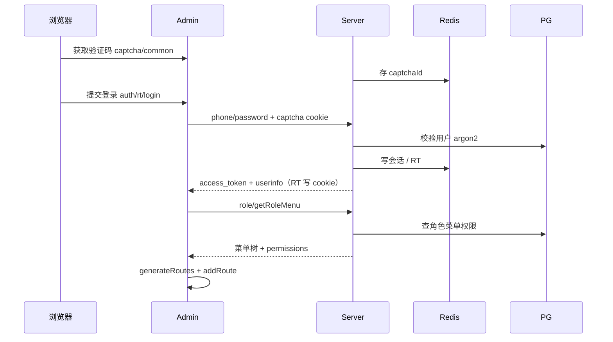
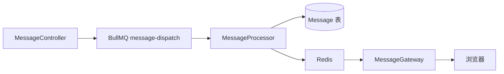

# 数据流

## 登录与动态菜单

## 鉴权业务请求

1. Axios 附加 `Authorization: Bearer <access_token>`
2. Nginx（生产）去掉 `/api` 前缀
3. Nest：限流 → JWT → PermissionGuard（可选 Redis 权限缓存）
4. Service 访问 Prisma / Redis
5. TransformInterceptor 包装响应

## Token 刷新

- 业务响应 401/406 → 独立请求 `POST /auth/refresh`（`withCredentials`）
- 成功：更新 Pinia token 并重试原请求
- Refresh 仍 401：清空登录态跳转登录页

## 站内消息派发

## 在线用户 / 监控

- 登录后前端建立 `/online/ws`、`/monitor/ws`（经 `/api` 反代）
- Presence 与踢人依赖 Redis + Gateway
- 监控快照：`GET /monitor/snapshot`（权限 `server:view`）

## 文件上传

- `POST /staticfile/upload` 或头像接口写入配置的静态根目录
- ServeStatic 以配置的 serveRoot 对外提供访问（示例：`api/public`）
- 元数据可写入 `File` 模型

## 操作日志

- `OperationLogInterceptor` 记录请求到 `UserOperationLog`
- 查询/删除：`/log/getUserOperationLogList`、`/log/deleteUserOperationLog`
- Schema 另有 `AuditLog`，当前无对等 HTTP 模块暴露
