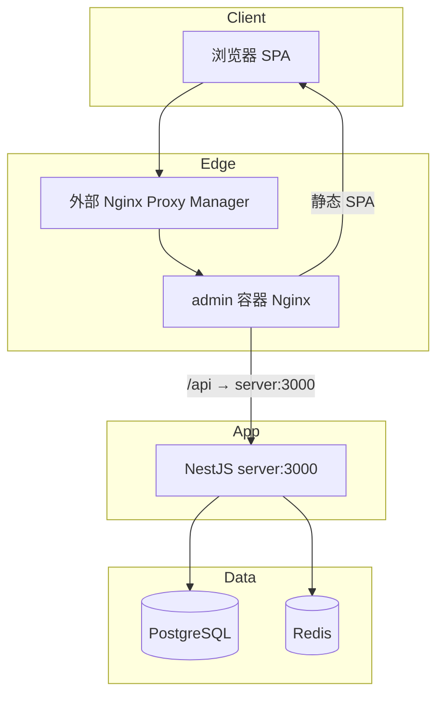
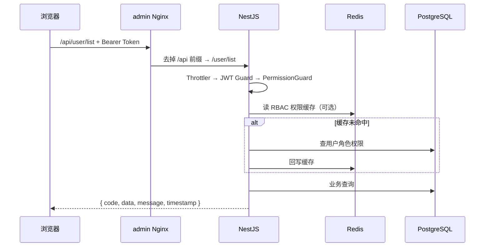

# 系统架构

## 项目简介

本仓库是一套 **后台管理系统**（monorepo 名 `admin2`），面向需要 RBAC 权限、组织架构、运维监控与站内消息的管理场景。

| 项       | 说明                                                                    |
| -------- | ----------------------------------------------------------------------- |
| 定位     | 企业后台：用户/角色/菜单/权限 + 部门字典 + 文件/日志/在线用户/监控/消息 |
| 使用场景 | 管理端 SPA + 统一 API；生产经 Docker Compose + 外部反代访问             |
| 技术选型 | NestJS 11、Prisma 7、PostgreSQL、Redis、Vue3、Vite、Element Plus        |

## 逻辑架构

```
Vue3 Admin  →  Nginx(/api 反代)  →  NestJS API  →  Prisma  →  PostgreSQL
                                      ↓
                                    Redis（会话 / 验证码 / RBAC 缓存 / 限流 / 消息）
                                      ↓
                                   BullMQ（消息派发队列）
```

### Mermaid：系统架构



### Mermaid：典型 HTTP 请求流



## 模块化设计

| 分层         | 路径                         | 职责                                                                                                      |
| ------------ | ---------------------------- | --------------------------------------------------------------------------------------------------------- |
| 核心基础设施 | `apps/server/src/core/`      | Config、Redis、静态资源、Swagger、日志                                                                    |
| 横切处理器   | `apps/server/src/processor/` | Guard / Decorator / Filter / Interceptor / RBAC 缓存                                                      |
| 业务系统     | `apps/server/src/system/`    | auth、user、role、menu、permission、department、dictionary、message、online、monitor、captcha、staticfile |
| 数据访问     | `apps/server/src/prisma/`    | Schema、Client、Seed、PgService                                                                           |
| 管理前端     | `apps/admin/src/`            | views / api / store / router / permission                                                                 |

`AppModule` 仅聚合 `CORE_MODULE` + `CORE_SYSTEM_MODULE`，业务以 Nest Module 边界划分。

## 分层设计（后端）

```
Controller（HTTP / 权限装饰器）
    → Service（业务）
        → PgService / Prisma Client（持久化）
        → Redis / BullMQ（缓存与异步）
```

全局能力：

- 校验：`GlobalZodValidationPipe`
- 响应：`TransformInterceptor` → `{ code, data, message, timestamp }`
- 异常：`AllExceptionsFilter`
- 操作日志：`OperationLogInterceptor` → `UserOperationLog`

## 权限设计（摘要）

- 模型：用户 ↔ 角色 ↔ 菜单 / 权限（RBAC）
- 后端：`@RequiredPermission('resource:action')` + 全局 `PermissionGuard`
- 超管角色 `code === 'super_admin'` 视为拥有 `*`
- 前端：服务端菜单动态路由 + `v-hasPermi` / Permission 组件

详见 [permission.md](./permission.md)。

## 扩展性

- 新增业务：在 `system/` 下新增 Module，注册到 `app.system.ts`
- 新增权限：菜单管理维护 Permission，角色分配后生效（含 Redis 缓存 TTL）
- 新增前端页：`views/` 落地组件，由服务端菜单 `component` 字段映射
- Schema 有 `Notice` / `AuditLog` 等表，**当前无对应业务 Controller**；扩展时可复用模型

## 部署形态

- Compose 服务：`postgres`、`redis`、`migrate`（一次性）、`server`、`admin`
- **不暴露宿主机端口**；依赖外部网络 `shared_net` 由 NPM 反代
- 注意：根 `README.md` 写创建网络 `shared`，`compose.yml` 实际使用外部网络名 **`shared_net`**

详见 [docker.md](../deployment/docker.md)。
