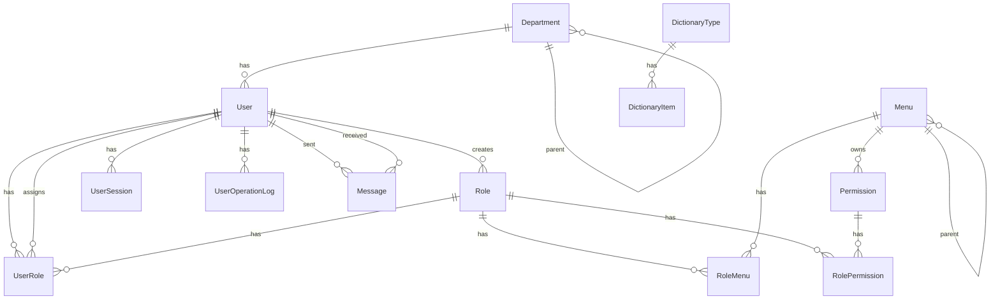

# 数据库设计

数据源：PostgreSQL。Schema：`apps/server/src/prisma/schema/schema.prisma`（单文件，无拆分）。

## ER 概览

## 模型说明

| Model                           | 要点                                                                                             |
| ------------------------------- | ------------------------------------------------------------------------------------------------ |
| User                            | cuid；phone/email 唯一；argon2 密码哈希；可选 department                                         |
| Role                            | code 唯一；`super_admin` 为超管约定；`isSystem`；`createdById` → User（SetNull）                 |
| UserRole                        | 复合主键 (userId, roleId)；`assignedById` → User（SetNull）                                      |
| Menu                            | 树；`MenuType` DIRECTORY / MENU；path/name 唯一；内嵌前端 meta 字段                              |
| Permission                      | code 唯一；挂 menuId；PermissionType                                                             |
| RoleMenu / RolePermission       | 角色资源绑定                                                                                     |
| Department                      | 树 + 物化 `path`；`(parentId, name)` 唯一                                                        |
| DictionaryType / DictionaryItem | 字典；`(typeId, value)` 唯一                                                                     |
| Message                         | 站内信/系统/告警；`(dispatchId, receiverId)` 唯一                                                |
| UserSession                     | tokenHash 唯一；过期时间                                                                         |
| UserOperationLog                | 操作日志（HTTP 暴露）                                                                            |
| File                            | 文件元数据（自增 id）                                                                            |
| Notice                          | 公告模型；**无 Nest Controller**；产品化（草稿/上下线/拉模型）延期，不阻塞消息收件箱与管理页拆分 |
| AuditLog                        | 审计模型；**无对等 HTTP 模块**                                                                   |

## 枚举

- `NoticeLevel`：INFO / SUCCESS / WARNING / ERROR
- `MenuType`：DIRECTORY / MENU
- `PermissionType`：BUTTON / DATA / API / OTHER
- `MessageType`：MAIL / SYSTEM / ALERT

## 账户与连接（生产）

Compose 区分三类 Postgres 用户（密码必须不同）：

| 用途     | 环境变量          | 注入方式                    |
| -------- | ----------------- | --------------------------- |
| 超级用户 | POSTGRES*ADMIN*\* | postgres 容器               |
| 迁移     | PG_DATABASE_URL   | migrate → `PG_DATABASE_URL` |
| 运行时   | PG_DATABASE_URL   | server → `PG_DATABASE_URL`  |

初始化脚本：`docker/postgres/init-users.sh`。

## Seed

- 入口：`apps/server/src/prisma/seed.ts`（菜单为空才灌入）
- 数据：`sql.ts`（菜单/角色/权限）+ `seed-admin.ts`（SEED*ADMIN*\*）
- 命令：`pnpm --filter server prisma:seed`
